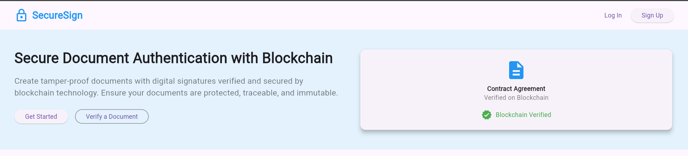
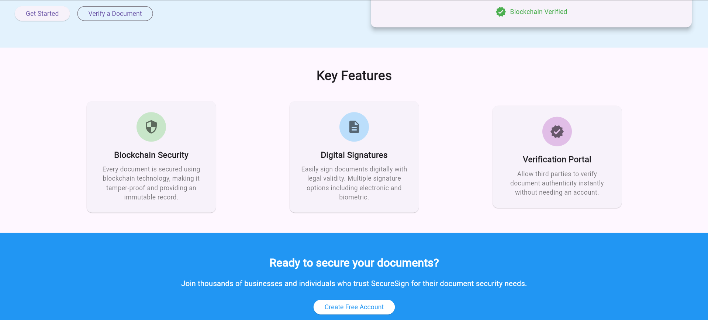
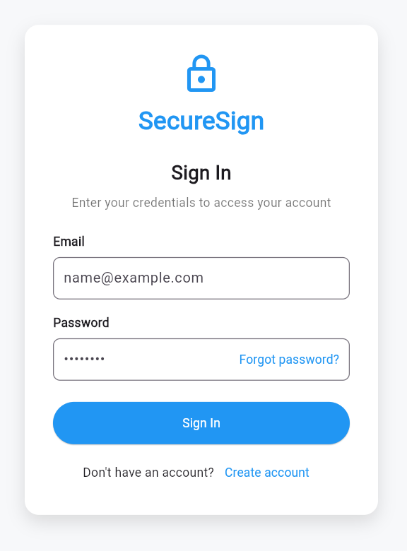
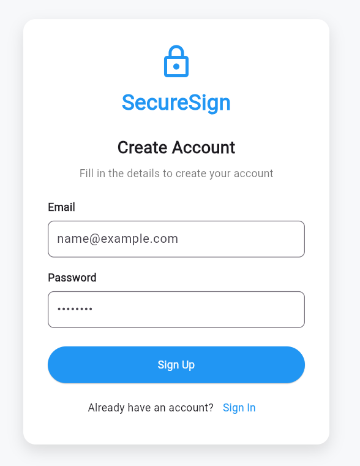

---

## Packages et technologies utilisés

- **Flutter** (SDK 3.x)
- **Dart**
- **Material Design**
- **Google Fonts** (Poppins)
- **Widgets Flutter** : Card, TextField, ElevatedButton, OutlinedButton, Row, Column, etc.

---

## Lancer le projet en local

1. **Cloner le dépôt**
   ```bash
   git clone https://github.com/Ouma49/securesign-flutter.git
   cd securesign-flutter
   ```

2. **Installer les dépendances**
   ```bash
   flutter pub get
   ```

3. **Lancer l’application**
   ```bash
   flutter run
   ```

4. **Tester la navigation**
   - Cliquez sur “Log In” ou “Sign Up” pour naviguer entre les pages.
   - Remplissez les formulaires pour tester l’UI.

---

## Explications pédagogiques

### Pourquoi ce projet ?

Ce projet met en pratique :
- La **création d’interfaces modernes** avec Flutter.
- La **navigation entre plusieurs écrans** (multi-pages).
- L’**utilisation de widgets avancés** et la personnalisation de l’UI.
- La **structuration professionnelle** d’un projet Flutter.

### Points techniques importants

- **Navigation** : Utilisation de `Navigator` et des routes nommées pour une navigation claire et évolutive.
- **Séparation des responsabilités** : Chaque page et composant est dans un fichier séparé pour faciliter la lecture et la maintenance.
- **Design** : Respect des standards Material Design, couleurs harmonieuses, polices modernes.
- **Accessibilité** : Utilisation de widgets standards pour garantir l’accessibilité de l’application.

---

## Captures d’écran

## Accueil




## Connexion



---

## Auteur

DAOUDI Oumayma
GitHub: https://github.com/Ouma49
Email: oumaymadaoudi1949@gmail.com
---

## Remarques pour l’évaluation

- Le projet est **fonctionnel** et **navigable**.
- Le code est **propre**, **commenté** et **structuré**.
- Les interfaces sont **fidèles** aux maquettes fournies.
- Les fonctionnalités Flutter demandées sont **toutes présentes**.

---

> Merci de votre attention et bonne découverte de l’application !
